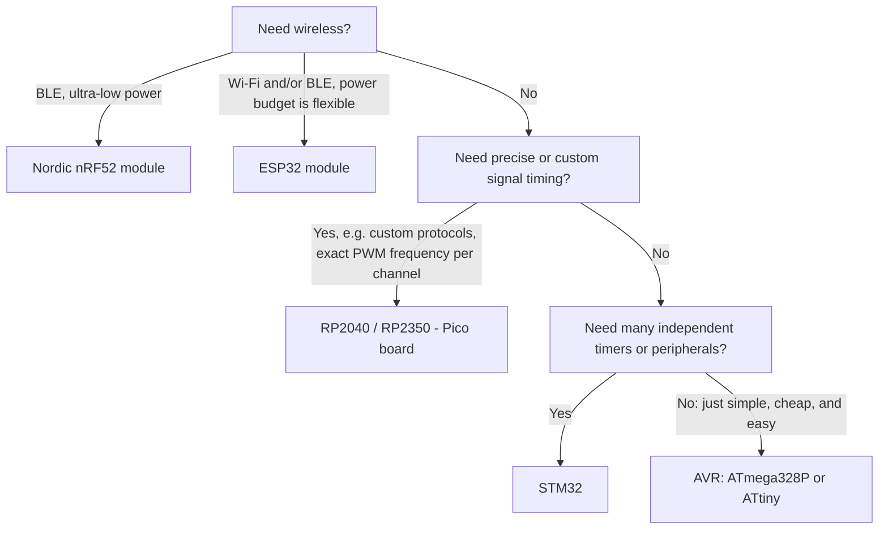

# MCU Selection for Low-Cost Hobby Projects

This guide addresses one-off and small-batch hobby builds: the goal is to take an idea from
concept to a working, hand-assembled board, not to optimize per-unit cost for a production run.
Two practical constraints matter most in that context:

- Can the chip be programmed directly from VSCode using PlatformIO, with mature, ideally official,
  platform support?
- Can the chosen package be hand-soldered, either as a bare chip with exposed leads (DIP, SOIC,
  TSSOP, or QFP) or as a pre-assembled module with through-hole or castellated pins? Packages whose
  pads sit only underneath the package (QFN, BGA) require hot-air rework or a reflow oven and are
  excluded here unless bought as a module.

A third constraint matters if the goal is specifically to solder the bare MCU onto a
self-designed board (PCB or perfboard) and program it in place, without relying on a dev kit: does
the chip need an RF matching network for a wireless antenna? A QFN or TSSOP package without a
radio can still be reflow-soldered onto a custom footprint and programmed over SWD, UPDI, or ISP
once it is on the board. A wireless chip's antenna matching network is a board-layout problem, not
a soldering problem, so even with reflow equipment the practical unit becomes a pre-certified RF
module rather than the bare die; that module is still soldered onto the target board directly, it
is just not the bare chip.

Once those constraints are satisfied, the remaining decision comes down to functional need:

1. Does the design require wireless communication?
2. Does it require timing precision beyond what a standard hardware timer provides?
3. Does it require more independent peripherals than an 8-bit device offers?

The sections below cover the MCU families that satisfy the PlatformIO and hand-solder constraints,
the conditions under which each is the appropriate choice, and their principal limitations.

## AVR: ATmega328P

An 8-bit AVR device such as the ATmega328P is typically the lowest-cost, lowest-complexity option
for digital I/O, PWM generation, and analog sensing. The ATmega328P (Arduino Uno/Nano) operates
its I/O at 5V, which allows direct interfacing with most 5V sensors and drivers without
level-shifting. PlatformIO support (`atmelavr` platform, `framework = arduino`) is official and
mature, with no additional board packages to install; it is the same setup already used
throughout this repository.

The ATmega328P is available in a 28-pin DIP package, which requires no special soldering
technique and plugs directly into a breadboard; this is the easiest package in this guide to
hand-assemble. A 32-pin TQFP package is available for surface-mount designs and remains
hand-solderable with a fine-tip iron and flux, since its leads are exposed around the perimeter
of the package. Either package is programmed in place through a 6-pin ISP header (MOSI, MISO,
SCK, RESET, VCC, GND) wired to the chip; no separate carrier board or chip removal is needed. A
bootloader can be burned once over that header, after which subsequent uploads can go over a
3-pin serial connection (RX, TX, DTR) to an external USB-to-serial adapter. A Nano or Uno module
uses the same serial-bootloader protocol, with the USB-to-serial adapter built onto the board
instead of wired in externally.

This repository uses the ATmega328P in `arduino-nano/pwm` and `arduino-nano/led-dimmer-4ch`. Both require only a
small number of PWM channels and analog inputs; verified builds use under 5% of flash and under
2% of RAM.

Single-unit distributor pricing (Digikey) for the ATmega328P runs $2.66 to $3.03 depending on
package. The ATmega328PB, a pin-compatible variant with a second USART, SPI, and I2C peripheral,
is priced lower at $1.63 to $1.70.

The ATmega328P becomes a limiting choice once a design needs more independent timers than the
three it provides, needs wireless communication, or needs a smaller and cheaper part than a
28-pin, 2KB-RAM device for a single well-defined job; the modern tinyAVR parts below address that
last case directly.

## AVR: Modern tinyAVR (0/1/2-series)

Microchip's tinyAVR 0/1/2-series parts, such as the ATtiny412, ATtiny1614, and ATtiny3224, are
frequently cited in hobbyist discussion as the preferred choice for a small, single-purpose job
that does not need the ATmega328P's pin count or memory. The part number encodes flash size,
series, and (for most of the lineup) pin count directly: ATtiny412 has 4KB of flash and an 8-pin
package, ATtiny1614 has 16KB of flash and a 14-pin package, and ATtiny3224 has 32KB of flash on
the newer 2-series core, which adds more timer and ADC capability than the 0- and 1-series parts.

Three properties drive their popularity. First, UPDI programming uses a single pin instead of the
six-pin SPI header an ISP programmer needs for classic AVR parts; a USB-to-serial adapter with one
added resistor is enough to build a UPDI programmer, so no dedicated programming hardware is
required, and the chip is programmed in place through that one pin plus VCC and GND, with no
removal or carrier board needed. Second, the internal oscillator is accurate enough for these
parts to run at full rated
speed without an external crystal or resonator, which removes two components and two board
footprints from the design. Third, quiescent and sleep current draw is low enough that these parts
show up regularly in coin-cell and always-on sensor designs.

PlatformIO's official `atmelavr` platform does not include board definitions for these parts. In
practice, they are used through the community-maintained megaTinyCore package, added to
`platformio.ini` as an extra platform package; this is a real setup step beyond what the
ATmega328P needs; it is not a one-line `board =` change. The parts are available in SOIC packages
(ATtiny412 in SOIC-8, ATtiny1614 in SOIC-14) with exposed gull-wing leads, so they remain
hand-solderable. Single-unit pricing for the ATtiny412 and ATtiny1614 runs $0.55 to $0.92
(Digikey).

## ESP32

The ESP32 is commonly selected when a design requires Wi-Fi, Bluetooth Low Energy, or both. It has
a dual-core architecture, and PlatformIO support (`espressif32` platform, `framework = arduino` or
`espidf`) is official and mature.

The bare ESP32 chip is a QFN package with pads only on its underside, which rules out hand
soldering. It also needs an RF matching network between the chip and its Wi-Fi/Bluetooth antenna,
which is a board-layout problem independent of soldering, so reflow equipment alone does not make
the bare chip practical for a hobby design. The realistic unit is a pre-certified module such as
an ESP32-WROOM-32, which includes the chip and its matching network on a small board with
castellated or through-hole edge pads; this module is soldered directly onto the target board and
programmed in place over its built-in USB-to-serial bootloader (or an external adapter wired to
its UART pins and a boot-mode strap), the same way the bare chip would be if it were solderable.
This is a different thing from a full ESP32 DevKitC-style development board, which additionally
carries a USB connector, voltage regulator, and reset/boot buttons the custom design would
otherwise provide itself.

The ESP32's I/O operates at 3.3V only; interfacing with 5V peripherals requires level-shifting.
Its power consumption is higher than an AVR device under comparable load, which makes it a poor
fit for battery-powered designs that do not require wireless connectivity.

## RP2040 and RP2350 (Raspberry Pi Pico)

The RP2040 and RP2350 are appropriate when a design requires signal timing beyond what a standard
hardware timer supports, such as a custom communication protocol or a PWM signal with parameters
outside a conventional timer's range. Each chip's PIO (Programmable I/O) block consists of small
state machines that execute independently of the main CPU; this is the primary technical
justification for choosing this family over AVR or ESP32. PlatformIO support (`raspberrypi`
platform, `framework = arduino` via the arduino-pico core) is actively maintained, though it is
not an official Raspberry Pi package.

The bare RP2040/RP2350 chip is a QFN package, which rules out a soldering iron, but neither chip
has a radio, so there is no antenna-matching problem to solve: with a hot-air station or a
toaster-oven reflow setup, the bare chip can be placed directly on a self-designed PCB. Once
soldered, it is programmed in place either over SWD or over its built-in USB ROM bootloader, which
exposes itself as a mass-storage device for drag-and-drop UF2 firmware updates when a BOOTSEL pin
is held low at power-up; wiring a single button and a USB connector to the chip is enough to
support that in place, with no separate programmer needed. Without reflow capability, the
Raspberry Pi Pico board is the practical fallback: it is a fully assembled module with
through-hole-friendly castellated edge pads.

Neither chip is optimized for low-power operation, which limits their suitability for
battery-powered designs with long sleep intervals. The RP2040 additionally requires an external
QSPI flash chip if the bare chip is being placed on a custom board rather than using a Pico
module. The RP2354, the same silicon as the RP2350 with 2MB of flash added in-package, removes
that external flash requirement.

## STM32: F0, G0, C0, and L0 families

STM32 devices are appropriate once a design requires more independent timers or peripherals than
an AVR or ATtiny device provides. STM32 is widely deployed in industry, so time invested in an
STM32-based design also builds skills transferable to professional embedded work. PlatformIO
support (`ststm32` platform) is official; `framework = arduino` gives an Arduino-style API, and
`framework = stm32cube` exposes the full HAL.

These four families occupy different points in ST's entry-level Cortex-M0/M0+ lineup:

| Family | Core | Purpose |
|---|---|---|
| F0 | Cortex-M0, up to 48MHz | ST's original entry-level family. Superseded by G0 for new mainstream designs; still available and inexpensive, but check part availability before committing to a new design. |
| L0 | Cortex-M0+, up to 32MHz | Ultra-low-power variant, with sub-microamp standby current in its low-power modes. Used for coin-cell and energy-harvesting designs that need an ARM core rather than an 8-bit part. |
| G0 | Cortex-M0+, up to 64MHz | ST's current mainstream entry-level family and F0's direct successor. More flash and RAM, and a more capable peripheral set (improved ADC, more timer channels), than F0 or C0 at a comparable price. |
| C0 | Cortex-M0+, up to 48MHz | ST's newest and lowest-cost family, positioned to compete with 8-bit MCUs and low-cost RISC-V parts on price while retaining the full STM32 toolchain. Fewer peripherals and less memory than G0 to reach that price point. |

At single-unit distributor pricing, C0 and G0 parts are comparable (see the table below); C0's
cost advantage is realized at production volume, similar to the CH32V003 pricing distinction
described above. For a hobby build, the practical choice is G0 by default, L0 if the design must
run for a long time on a small battery, and F0 or C0 only if a specific part from those families
is already what a tutorial or reference design targets.

Entry-level STM32 parts are commonly available in TSSOP20 and LQFP32/48 packages. Both have
exposed gull-wing leads around the package perimeter and are hand-solderable with a fine-tip iron
and flux, though the lead pitch (0.5 to 0.65mm) makes them noticeably fiddlier than a DIP or SOIC
AVR part. ST's own Nucleo boards exist for all four families (e.g., Nucleo-F031K6,
Nucleo-L031K6, Nucleo-G031K8, Nucleo-C031C6) and avoid the soldering question entirely by
exposing 0.1-inch headers.

Configuration is typically performed through ST's HAL and the CubeMX tool, which introduces a
steeper initial learning curve than the Arduino core. Programming and debugging use SWD, a 2-wire
interface (plus power and ground) that a low-cost ST-Link probe connects to directly on the
target board; like ISP and UPDI, this programs the chip in place with no removal needed, but it
requires that separate probe rather than the plain serial bootloader AVR and ESP32 boards use.

Single-unit pricing for entry-level parts in these families (STM32G030F6, STM32C011F6,
STM32F030F4, STM32L031F6) runs $1.34 to $1.94 (Digikey).

## Nordic nRF52832 and nRF52840

These parts are the appropriate choice when a design requires Bluetooth Low Energy and must
operate from a small battery for an extended period; Nordic parts are widely cited for leading
power efficiency in that combination. PlatformIO support (`nordicnrf52` platform, built on
Adafruit's nRF52 Arduino core) is community-maintained and generally reliable, though not an
official Nordic package.

The bare nRF52 chip is available in QFN and WLCSP packages, and like the ESP32, it needs an RF
matching network for its Bluetooth antenna, so the practical unit is a pre-certified module (for
example, Raytac's MDBT50Q or Fanstel's BT840 series) rather than the bare die. These modules
expose castellated or through-hole pins and are soldered directly onto the target board, then
programmed in place over SWD. This is a different thing from a full development board, such as
Adafruit's Feather nRF52840, which adds USB, a voltage regulator, and battery-charging circuitry
on top of the same module.

Development boards for this family cost more than comparable ESP32 or RP2040 boards, and the SDK
is built around Nordic's softdevice model, which has a steeper learning curve than the other
families covered here. Absent both a BLE requirement and a tight power budget, this family
exceeds what a hobby project typically needs.

## Excluded: cost-at-volume parts (CH32V003 and similar)

WCH's CH32V003 and similar sub-$0.50 RISC-V parts are not covered above. Their primary advantage
is unit cost at production volume, which is not relevant to a one-off hobby build, and PlatformIO
support for them is unofficial and less mature than the families above (a community-maintained
platform exists, but the popular CH32V003Fun bare-metal framework does not integrate with
PlatformIO's normal project structure at all).

## Comparison table

| MCU / Family | PlatformIO support | Bare-chip hand assembly | In-circuit programming | Best for | Watch out for |
|---|---|---|---|---|---|
| ATmega328P / 328PB (Nano/Uno) | Official (`atmelavr`) | Yes: DIP-28 or TQFP-32 | 6-pin ISP, then a serial bootloader | Simple I/O, PWM, ADC | 2KB of RAM; shared-timer PWM frequency limits (see `arduino-nano/pwm`) |
| ATtiny (412, 1614, etc.) | Official platform plus a third-party core, such as megaTinyCore | Yes: SOIC-8/SOIC-14 | Single-pin UPDI | Small, single-purpose jobs; no crystal needed | Fewer pins and peripherals; extra board-package setup |
| ESP32 (including S3, C3) | Official (`espressif32`) | No: bare chip needs an RF matching network for its antenna; use a WROOM-style module | Built-in USB-to-serial ROM bootloader | Wi-Fi, BLE, dual-core headroom | 3.3V only; higher power draw than AVR |
| RP2040 / RP2350 | Actively maintained, unofficial (arduino-pico) | Reflow/hot-air only: bare chip is QFN but has no radio, so a self-designed PCB is viable; iron-only builds should use a Pico board | SWD, or a built-in USB ROM bootloader (BOOTSEL) | Custom or precise timing through PIO | 3.3V; external flash needed unless using the flash-integrated RP2354; no FPU on the RP2040 |
| STM32 (F0, G0, C0, L0) | Official (`ststm32`) | Yes: TSSOP20/LQFP32-48 (fine pitch, fiddlier than DIP/SOIC) | SWD via an ST-Link probe | Many independent timers/peripherals; skills that transfer to industry | 3.3V; HAL/CubeMX learning curve; needs a probe, not plain serial upload |
| Nordic nRF52832 / nRF52840 | Community-maintained (Adafruit nRF52 core) | No: bare chip needs an RF matching network for its antenna; use a certified module (e.g., Raytac MDBT50Q) | SWD | Leading low-power BLE performance | 3.3V; softdevice SDK complexity; pricier boards |

## Decision tree

---

This guide was compiled from developer community discussion on r/embedded and r/microcontrollers.
Pricing figures are single-unit Digikey quotes as of this writing. Check current datasheets and
pricing before committing to a part.
