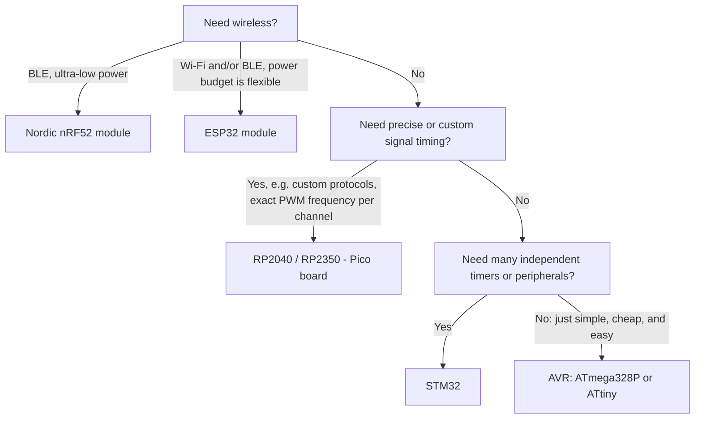

# MCU Selection for Low-Cost Hobby Projects

This guide covers one-off and small-batch hobby builds. It optimizes for hand-assembly and
PlatformIO support, not per-unit production cost.

Two constraints filter every option below:

- PlatformIO must support the chip from VSCode, ideally through an official platform.
- The package must be hand-solderable: exposed leads (DIP, SOIC, TSSOP, QFP), or a pre-assembled
  module with through-hole or castellated pins. QFN and BGA have pads only underneath the package
  and are excluded unless bought as a module.

A third constraint applies only when soldering a bare MCU onto a self-designed board rather than
using a dev kit: does the chip need an RF antenna-matching network? A QFN or TSSOP chip with no
radio can still be reflow-soldered onto a custom footprint and programmed in place over SWD, UPDI,
or ISP. A chip with a radio cannot — the antenna-matching network is a board-layout problem, not a
soldering problem, so the practical unit becomes a pre-certified RF module instead of the bare die.
That module still solders directly onto the target board; it just isn't the bare chip.

If the requirement is specifically the **bare chip, hand-solderable with an iron, no module or dev
board substitute**, that rules out ESP32, RP2040/RP2350, and the Nordic nRF52 family entirely —
all three are QFN-only in bare form, and ESP32/nRF52 additionally need an antenna-matching network
no module conveniently sidesteps. What remains hand-solderable as a bare chip: ATmega328P/328PB,
tinyAVR, ATmega32U4, STM32 (TSSOP/LQFP packages), Microchip PIC16F145x/PIC18F14K50, and classic
ATtiny (software USB). See "AVR: ATmega32U4", the USB note in the STM32 section, "Microchip PIC",
and "Software USB" below for the bare-chip options that also have USB. WCH's CH552 also fits this
constraint on paper (SOIC-16/TSSOP-20, real USB peripheral) but isn't stocked on Digikey/Mouser —
see "Excluded" below.

Once a chip clears both constraints, three questions decide the family:

1. Does the design need wireless communication?
2. Does it need timing precision beyond a standard hardware timer?
3. Does it need more independent peripherals than an 8-bit device offers?

## AVR: ATmega328P

Use this for digital I/O, PWM, and analog sensing. It's the lowest-cost, lowest-complexity option
in this guide.

- 5V I/O — interfaces directly with most 5V sensors and drivers, no level-shifting.
- PlatformIO: official (`atmelavr`, `framework = arduino`), no extra setup. Same config already
  used throughout this repo.
- DIP-28 needs no soldering technique — plugs into a breadboard. TQFP-32 is hand-solderable with a
  fine-tip iron and flux.
- Programs in place via a 6-pin ISP header (MOSI, MISO, SCK, RESET, VCC, GND). Burn a bootloader
  once over ISP, then upload over 3-wire serial (RX, TX, DTR) to an external USB-to-serial adapter.
  A Nano/Uno module is the same thing with that adapter built onto the board.
- Used in this repo: `arduino-nano/pwm`, `arduino-nano/led-dimmer-4ch`. Both run under 5% flash,
  under 2% RAM.
- Single-unit price (Digikey): $2.66-$3.03. The ATmega328PB — pin-compatible, adds a second
  USART/SPI/I2C — is cheaper: $1.63-$1.70.
- Limits: three hardware timers, no wireless, and it's overkill (pin count, RAM) for a single
  well-defined small job — use tinyAVR instead.

## AVR: Modern tinyAVR (0/1/2-series)

Use this for a small, single-purpose job that doesn't need the 328P's pin count or memory.

The part number encodes flash size and pin count: ATtiny412 = 4KB flash, 8-pin. ATtiny1614 = 16KB
flash, 14-pin. ATtiny3224 = 32KB flash, newer 2-series core with more timer/ADC capability.

Three reasons these are popular:

- UPDI programming uses one pin, not ISP's six. A USB-to-serial adapter plus one resistor is a
  UPDI programmer — no dedicated programming hardware needed.
- The internal oscillator is accurate enough to run at full rated speed with no external crystal —
  two fewer components, two fewer footprints.
- Low sleep current — common in coin-cell and always-on sensor designs.

- PlatformIO: `atmelavr` has no board definitions for these parts. In practice, add megaTinyCore
  as an extra platform package — a real setup step, not a one-line `board =` change.
- Packages: ATtiny412 in SOIC-8, ATtiny1614 in SOIC-14 — gull-wing leads, hand-solderable.
- Single-unit price (Digikey): $0.55-$0.92.

## AVR: ATmega32U4 (native USB, bare-chip hand-solderable)

Use this when the design needs native USB — no external USB-to-serial bridge chip anywhere on the
board — while staying on the same AVR toolchain and Arduino ecosystem as the 328P/tinyAVR sections
above.

- Native USB 2.0 full-speed device peripheral on-die (Arduino Leonardo/Micro's CDC-ACM serial, or
  HID/MSC via firmware). No CH340/CP2102/FT232 bridge chip anywhere on the board.
- PlatformIO: official (`atmelavr`, `board = leonardo` or `micro`, `framework = arduino`). Same
  toolchain as 328P/328PB.
- Package: TQFP-44, 0.8mm pitch — the same solderability class as the 328P's TQFP-32, and the
  easiest bare-chip native-USB option in this guide. A QFN-44 variant exists too; skip it for hand
  assembly, since its pads sit only underneath the package.
- Programs in place the same way as 328P: burn the Caterina USB bootloader once over a 6-pin ISP
  header, then upload directly over the USB port afterward — no external adapter needed at all,
  unlike 328P/tinyAVR, which still need one for every upload after the bootloader is burned.
- Single-unit price (Digikey), TQFP-44: $5.26-$5.40 — roughly double the 328P, triple the 328PB.
- Limits: the Caterina bootloader uses more flash than 328P's optiboot (~4KB vs ~0.5KB), leaving
  less usable space out of the same 32KB total. USB enumeration/reset timing is fussier than a
  plain serial bootloader — occasional double-tap-reset quirks during upload are well documented
  on Pro Micro clones.

## Software USB: V-USB on classic ATtiny (e.g. ATtiny85)

Use this only for the cheapest possible USB-capable chip, and only for an HID-class device
(keyboard/mouse emulation, simple control transfers) — not a general-purpose serial link.

- No hardware USB peripheral. USB is implemented entirely in firmware (the V-USB library),
  bit-banging two GPIO pins at USB 1.1 low-speed (1.5Mbit/s) timing. This is how Digispark-style
  ATtiny85 boards work.
- Package: ATtiny85 in SOIC-8 or PDIP-8 — as easy to hand-solder as any AVR in this guide.
- PlatformIO: `atmelavr` has no ATtiny85 board defs; add ATTinyCore as an extra platform
  package, the same kind of setup step as megaTinyCore for modern tinyAVR. V-USB itself is a
  plain C library dependency, not a platform feature.
- Single-unit price (Digikey), ATtiny85-20SU: $1.50 — the cheapest USB-capable chip in this guide
  with any Digikey/Mouser stock.
- Limits: low-speed USB suits HID well; CDC-ACM (virtual serial port) over V-USB is unreliable and
  nonstandard — don't use this for a "plug in and get a serial port" design. Bit-banging leaves
  only 2 of 8 pins free once USB is wired up. Timing is sensitive to clock accuracy.

## Microchip PIC: PIC16F1454/1455/1459 and PIC18F14K50

Use this for a native-USB design outside the Arduino/PlatformIO ecosystem entirely — Microchip's
classic cheap USB PICs, still in production.

- Native USB 2.0 full-speed device peripheral on-die — no bridge chip, no bit-banging.
- Packages: PIC16F1454/1455 in 14-pin DIP/SOIC/SSOP; PIC16F1459 also in an 18-pin variant with
  more I/O; PIC18F14K50 in 20-pin DIP/SOIC. All hand-solderable — the 16F145x's DIP-14 is
  breadboard-friendly, the same class as the 328P's DIP-28.
- Tooling: **no PlatformIO support**. Programmed via MPLAB X IDE and the XC8 compiler —
  Microchip's own toolchain, not `pio run` or `framework = arduino`. This is a genuinely different
  workflow than everything else in this guide, not an extra setup step on top of the same one.
- Single-unit price (Digikey): PIC16F1455-I/P (DIP-14) $2.14, PIC18F14K50-I/SO (SOIC-20) $3.05 —
  both cheaper than the 32U4; the 16F1455 is the cheapest DIP native-USB option in this guide.
- Limits: leaving PlatformIO/VSCode entirely is the real cost here, not price or package. Pick
  this only if that toolchain switch is acceptable.

## ESP32

Use this when the design needs Wi-Fi, Bluetooth Low Energy, or both.

- PlatformIO: official (`espressif32`, `framework = arduino` or `espidf`).
- 3.3V only — level-shifting needed for 5V peripherals. Higher power draw than AVR — a poor fit
  for battery designs that don't need wireless.
- The bare chip is QFN — pads underneath, not hand-solderable — and needs an antenna-matching
  network, so a module is the only practical unit regardless of soldering equipment. Use a
  WROOM-32/-C3/-S3 module: the matching network is on the module itself, with castellated or
  through-hole pads, soldered directly onto the target board.
- USB: the original ESP32 has no native USB peripheral. A WROOM-32 module's USB port is a separate
  CP2102/CH340 bridge chip mounted on the module — the same bridge-chip dependency as an AVR board.
  ESP32-S2, S3, and C3 have a real on-die USB peripheral (USB Serial/JTAG on C3/S3, USB OTG on
  S2/S3) — no bridge chip anywhere on the module. To avoid a bridge chip, use C3 or S3, not the
  original ESP32.
- A module is not a full DevKitC-style dev board. The dev board adds a USB connector, voltage
  regulator, and reset/boot buttons that a custom design provides itself.

## RP2040 and RP2350 (Raspberry Pi Pico)

Use this when the design needs signal timing beyond a standard hardware timer — a custom protocol,
or PWM parameters outside a normal timer's range. The PIO (Programmable I/O) block runs small
state machines independent of the CPU. That capability is the reason to pick this family over AVR
or ESP32.

- Native USB (device and host modes) — no bridge chip.
- PlatformIO: actively maintained, unofficial (`raspberrypi`, arduino-pico core).
- The bare chip is QFN — no soldering iron — but it has no radio, so a self-designed PCB is viable
  with hot air or a toaster-oven reflow setup. Without reflow capability, use a Pico board: fully
  assembled, castellated through-hole-friendly edge pads.
- Programs in place over SWD, or the built-in USB ROM bootloader (BOOTSEL button, drag-and-drop
  UF2). One button and one USB connector is enough — no separate programmer needed.
- Not optimized for low power — a poor fit for long-sleep battery designs.
- RP2040 needs an external QSPI flash chip on a custom board. RP2350's flash-integrated variant,
  RP2354, removes that requirement.

## STM32: F0, G0, C0, and L0 families

Use this when the design needs more independent timers or peripherals than AVR/ATtiny provides.
STM32 skills transfer directly to professional embedded work.

| Family | Core | Purpose |
|---|---|---|
| F0 | Cortex-M0, ≤48MHz | Original entry-level family. Superseded by G0; still available and cheap — check part availability before a new design. |
| L0 | Cortex-M0+, ≤32MHz | Ultra-low-power. Sub-microamp standby. Use for coin-cell/energy-harvesting designs needing an ARM core. |
| G0 | Cortex-M0+, ≤64MHz | Current mainstream family, F0's successor. More flash/RAM, better peripherals than F0/C0 at a similar price. |
| C0 | Cortex-M0+, ≤48MHz | Newest, cheapest family — competes with 8-bit MCUs on price. Fewer peripherals and less memory than G0. |

Default to G0. Use L0 for battery life. Use F0 or C0 only if a specific tutorial or reference
design already targets that part — at single-unit pricing, C0's cost advantage only appears at
production volume.

- PlatformIO: official (`ststm32`). `framework = arduino` for an Arduino-style API,
  `framework = stm32cube` for the full HAL.
- Packages: TSSOP20, LQFP32/48 — hand-solderable with a fine-tip iron and flux, but 0.5-0.65mm
  pitch is fiddlier than DIP/SOIC AVR parts.
- Nucleo boards exist for all four families and skip the soldering question entirely (0.1" headers).
- Programming and debug: SWD via an ST-Link probe — not the plain serial bootloader AVR/ESP32 use.
- Configuration goes through ST's HAL and CubeMX — steeper learning curve than the Arduino core.
- Single-unit price (Digikey), entry-level parts: $1.34-$1.94.
- Not every part in these families has USB — check the specific device's peripheral list before
  committing. Base STM32C0 (C011/C031/C051/C092) has no USB at all; **STM32C071** is the C0
  subfamily that added it. Common hobbyist picks with USB, cheapest first:
  - **STM32C071F8P6** (TSSOP20, $1.53) — crystal-less USB, the cheapest bare-chip hand-solderable
    USB part in this entire guide.
  - **STM32F042F6P6TR** (TSSOP20, $3.64) — crystal-less USB, older and far more documented than
    C071 (in circulation since ~2014).
  - **STM32G0B1CBT6** (LQFP48, $4.59) — crystal-less USB, more flash/peripherals than the TSSOP20
    parts above, at a finer 0.5mm pin pitch.
  - **STM32F103C8T6** (the "blue pill" chip, LQFP48, $7.30-$7.45) — needs an external HSE crystal
    for accurate USB timing, the most expensive and least convenient of the four, but the most
    widely documented online.

## Nordic nRF52832 and nRF52840

Use this when the design needs Bluetooth Low Energy and long battery life. Nordic leads on power
efficiency for that combination.

- PlatformIO: community-maintained (`nordicnrf52`, built on Adafruit's nRF52 Arduino core).
- Bare chip: QFN or WLCSP, needs an antenna-matching network like ESP32 — use a certified module
  (Raytac MDBT50Q, Fanstel BT840), soldered directly onto the target board, programmed over SWD.
- A module is not a full dev board. A dev board (e.g. Adafruit Feather nRF52840) adds USB, a
  regulator, and battery charging on top of the same module.
- Boards cost more than comparable ESP32/RP2040 boards. The SDK's softdevice model has a steeper
  learning curve.
- Skip this family unless the design needs both BLE and a tight power budget.

## Excluded: cost-at-volume and China-only-sourced parts (CH32V003, CH552, and similar)

Not covered: WCH's CH32V003 and similar sub-$0.50 RISC-V parts. Their only advantage is unit cost
at production volume — irrelevant for a one-off build. PlatformIO support is unofficial and
immature; the popular CH32V003Fun framework doesn't integrate with PlatformIO's project structure
at all.

WCH's **CH552** is a different case: an 8051 core with a real on-die USB FS device controller and
transceiver, in SOIC-16 or TSSOP-20 — both hand-solderable. It has genuine hardware USB, unlike
the CH32V003. It's excluded from the main comparison for the same reason as WCH's CH340
USB-UART bridge chip: no Digikey/Mouser stock, sourced through LCSC/AliExpress/Tindie instead, at
roughly $0.30-$0.40 — dramatically cheaper than anything else in this guide, if that sourcing path
and its rougher tooling (no PlatformIO support found) are acceptable.

## Comparison table

| MCU / Family | Native USB? | Bare-chip hand assembly | PlatformIO support | In-circuit programming | Best for | Watch out for |
|---|---|---|---|---|---|---|
| ATmega328P / 328PB (Nano/Uno) | No | Yes: DIP-28 or TQFP-32 | Official (`atmelavr`) | 6-pin ISP, then a serial bootloader | Simple I/O, PWM, ADC | 2KB of RAM; shared-timer PWM frequency limits (see `arduino-nano/pwm`) |
| ATtiny (412, 1614, etc.) | No | Yes: SOIC-8/SOIC-14 | Official platform plus a third-party core, such as megaTinyCore | Single-pin UPDI | Small, single-purpose jobs; no crystal needed | Fewer pins and peripherals; extra board-package setup |
| ATmega32U4 | Yes | Yes: TQFP-44 (skip the QFN-44 variant) | Official (`atmelavr`, board = leonardo/micro) | USB directly, after one ISP-burned bootloader | Bare-chip native USB on a familiar AVR/Arduino toolchain | Pricier than 328P/328PB ($5.26-$5.40); bootloader eats more flash; reset/enumeration quirks |
| ATtiny85 (V-USB, software) | Yes (software, low-speed only) | Yes: SOIC-8/PDIP-8 | Official platform plus ATTinyCore; V-USB is a separate library | Same ISP/bootloader path as other AVR | Absolute cheapest USB-capable chip with Digikey/Mouser stock ($1.50) | HID-only in practice; CDC/serial is unreliable; only 2 free pins after USB |
| PIC16F1454/1455/1459, 18F14K50 | Yes | Yes: DIP-14/18/20, SOIC, SSOP | **None** — MPLAB X + XC8, not PlatformIO | USB bootloader or ICSP | Cheapest DIP native-USB option ($2.14-$3.05) | Leaves the PlatformIO/Arduino workflow entirely |
| ESP32 (including S2, S3, C3) | Original: no (bridge chip on module). S2/S3/C3: yes | No: bare chip needs an RF matching network for its antenna; use a WROOM-style module | Official (`espressif32`) | Original ESP32: bridge chip on the module. S2/S3/C3: real on-die USB, no bridge chip | Wi-Fi, BLE, dual-core headroom | 3.3V only; higher power draw than AVR; bare chip never qualifies as hand-solderable |
| RP2040 / RP2350 | Yes | Reflow/hot-air only: bare chip is QFN but has no radio, so a self-designed PCB is viable; iron-only builds should use a Pico board | Actively maintained, unofficial (arduino-pico) | SWD, or a built-in USB ROM bootloader (BOOTSEL) | Custom or precise timing through PIO | 3.3V; external flash needed unless using the flash-integrated RP2354; no FPU on the RP2040; bare chip isn't iron-solderable |
| STM32 (F0, G0, C0, L0) | Some parts — cheapest USB picks are C071F8P6 ($1.53) and F042F6P6TR ($3.64), both TSSOP20 | Yes: TSSOP20/LQFP32-48 (fine pitch, fiddlier than DIP/SOIC) | Official (`ststm32`) | SWD via an ST-Link probe | Many independent timers/peripherals; skills that transfer to industry | 3.3V; HAL/CubeMX learning curve; needs a probe, not plain serial upload |
| Nordic nRF52832 / nRF52840 | No (BLE, not wired USB) | No: bare chip needs an RF matching network for its antenna; use a certified module (e.g., Raytac MDBT50Q) | Community-maintained (Adafruit nRF52 core) | SWD | Leading low-power BLE performance | 3.3V; softdevice SDK complexity; pricier boards |

## Decision tree

---

Compiled from developer community discussion on r/embedded and r/microcontrollers. Pricing is
single-unit Digikey, as of this writing. Check current datasheets and pricing before committing to
a part.
